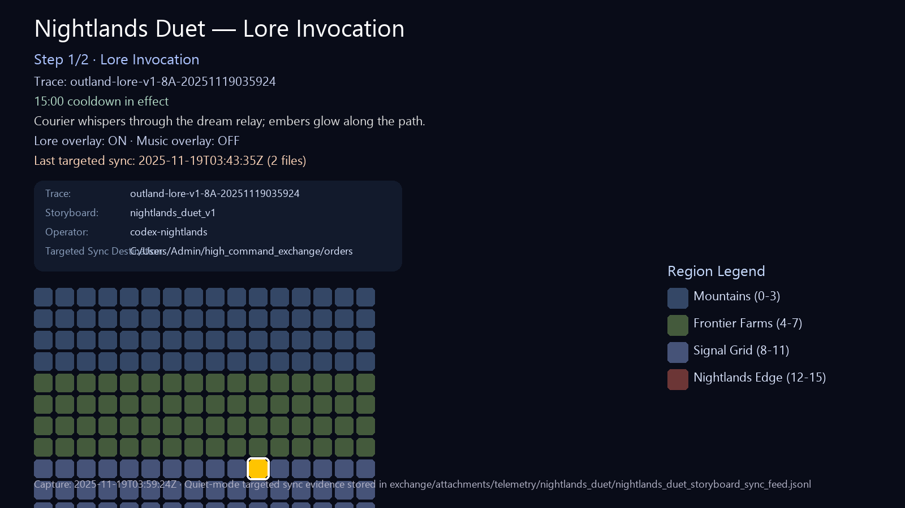
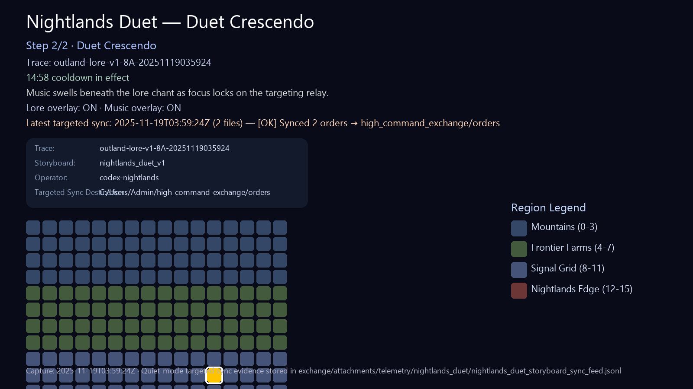

# Nightlands Duet Playtest Packet

## Objective

Provide operators with everything needed to replay and validate the Nightlands duet storyboard run executed at 2025-11-12T00:49:57Z as part of Order-048.

## Storyboard Run Summary

- Storyboard ID: `nightlands_duet_v1`
- Run timestamp: `2025-11-12T00:49:57.652565Z`
- Trace ID: `outland-lore-v1-8A-20251112004957`
- Steps:
  1. Lore Invocation → Cell `8A` → Overlay `outland-lore-v1`
  2. Duet Crescendo → Cell `9B` → Overlays `outland-lore-v1`, `outland-music-v1`
- Force override: `false`
- Cooldown at dispatch: `900` seconds remaining

Source log: `logs/alfa_zero/storyboards/nightlands_duet_v1_runs.jsonl`

### Quick verification

```pwsh
Get-Content logs/alfa_zero/storyboards/nightlands_duet_v1_runs.jsonl | Select-String "outland-lore-v1-8A-20251112004957"
```

## Payload Artifacts

The run emitted two payloads; both were synced to the exchange hub.

| Kind | Local path |
| ---- | ---------- |
| Signal Loop (dream) | `outbox/orders/emoji_runtime/20251112T004957Z_alfa_zero_signal_loop_dream.json` |
| Signal Loop (focus) | `outbox/orders/emoji_runtime/20251112T004957Z_alfa_zero_signal_loop_focus.json` |

### Suggested spot-checks

1. Confirm payload trace alignment:

   ```pwsh
   Get-Content outbox/orders/emoji_runtime/20251112T004957Z_alfa_zero_signal_loop_focus.json | Select-String "outland-lore-v1-8A-20251112004957"
   ```


2. Validate duet overlays were requested (music + lore) inside both payloads.

## Scoreboard Imagery

Annotated scoreboard frames now live under `exchange/attachments/media/nightlands_duet/` for both key storyboard states:

- Lore Invocation → `nightlands_duet_scoreboard_lore_invocation.png`
- Duet Crescendo → `nightlands_duet_scoreboard_duet_crescendo.png`

Each export has a companion metadata file describing annotations, cooldown timers, and targeted sync signals:

- `nightlands_duet_scoreboard_lore_invocation.metadata.json`
- `nightlands_duet_scoreboard_duet_crescendo.metadata.json`

Current exports are placeholder composites derived from Alfa Zero layout references; replace them with full-resolution captures when art tooling is back online.

Embed previews when presenting to cohorts:





Field Usage:

- Reference cooldown deltas during operator briefings so the cohort expects the 15-minute guardrail between duet runs.
- Use the targeted sync summary chip callout to remind operators when the helper last mirrored payloads.
- When updating the packet, review `scoreboard_imagery_manifest.md` to keep filenames and annotations aligned.

## Targeted Sync Evidence

A post-run targeted sync mirrored the latest duet payloads to the exchange hub.

- Latest log: `logs/alfa_zero/targeted_sync_20251112T105026Z.log`
- Prior run log: `logs/alfa_zero/targeted_sync_20251112T124500Z.log`
- Key lines:
  - `Latest: 2`
  - `Copied ... emoji_runtime/20251112T004957Z_alfa_zero_signal_loop_focus.json`
  - `Copied ... factory_orders/20251112T004957Z_emoji-signal-loop-focus-20251112004957_656564.json`
- Combined telemetry feed: `exchange/attachments/telemetry/nightlands_duet/nightlands_duet_storyboard_sync_feed.jsonl` (append-only JSONL for duet storyboard runs and targeted syncs).

Re-run helper (optional):

```pwsh
python -m tools.targeted_sync --latest 2 --yes
```

## Operator Brief Excerpt

- Readiness: Verify `fun_flags.balance_toggles` and run `python -m tools.ops_readiness`.
- Consent: Enable Lore and Music overlays inside Alfa Zero UI before dispatching.
- Preview: Use `storyboard preview` to review both phases and confirm cooldown timers.
- Dispatch: Trigger `storyboard run` (reserve `storyboard run force` for cleared overrides only).
- Evidence: Collect payloads under `outbox/orders/emoji_runtime/` plus telemetry from `logs/alfa_zero/` and log the run in the ledger.
- Post-run: Check `logs/alfa_zero/session_metrics.jsonl` for dispatch entries covering both storyboard steps and confirm the telemetry feed at `exchange/attachments/telemetry/nightlands_duet/nightlands_duet_storyboard_sync_feed.jsonl` captured the storyboard + targeted sync pairing.

## Operator Playtest Checklist

1. Review storyboard status in the Alfa Zero UI to confirm cooldown expiry before rerunning.
2. Execute the `nightlands_duet_v1` storyboard via `alfa_zero_ui.py` (`nightlands duet` command).
3. Capture the resulting trace ID and compare with the baseline listed above.
4. Sync the newly generated payloads using the targeted sync helper (`--latest 2`).
5. Record results in `exchange/ledger/2025-11.md` and attach supporting logs.

## Session Metrics Snapshot

- Excerpt file: `exchange/attachments/guides/nightlands_duet_session_metrics_excerpt.jsonl`
- Trace recorded: `outland-lore-v1-8A-20251112004957`
- Source log: `logs/alfa_zero/session_metrics.jsonl`
- For future runs, capture the relevant lines with:

  ```pwsh
  Select-String -Path logs/alfa_zero/session_metrics.jsonl -Pattern "nightlands_duet_v1" -Context 0,2
  ```

- File new excerpts alongside this packet whenever the duet trace changes.

## Follow-up Notes

- Session metrics excerpt captured; update when new traces are generated.
- Scoreboard imagery placeholders staged; swap in production captures once art export pipeline resumes.
- Telemetry feed schema documented in `exchange/attachments/telemetry/nightlands_duet/nightlands_duet_telemetry_manifest.md`; update dashboards and packet references after each new run.
- Interim cadence panel lives in `docs/nightlands_duet_telemetry_panel.md` with a quick script that summarises storyboard and targeted sync activity from the feed; include its output in debriefs until the full dashboard tooling returns.


